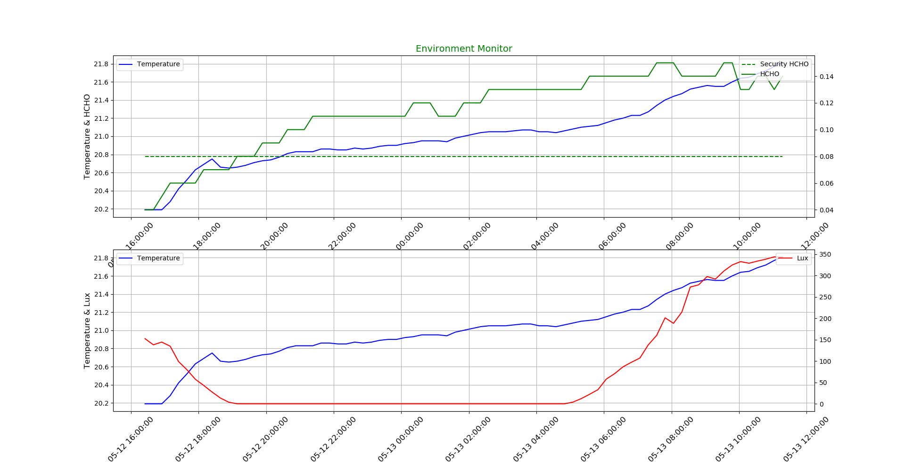

# [python之matplotlib绘图基础](http://www.cnblogs.com/liutongqing/p/6985805.html)




参考：

[python之matplotlib绘图基础](http://www.cnblogs.com/liutongqing/p/6985805.html)

Python--matplotlib绘图可视化知识点整理https://www.cnblogs.com/zhizhan/p/5615947.html

python matplotlib 绘制双Y轴曲线图https://blog.csdn.net/autoliuweijie/article/details/51594373

时间格式化 https://blog.csdn.net/qianshuyuankk/article/details/79310463

设置时间间隔 https://blog.csdn.net/ZengHaihong/article/details/70747247

# Python之matplotlib基础

matplotlib是Python优秀的数据可视化第三方库
matplotlib库的效果可参考
<http://matplotlib.org/gallery.html>
matplotlib的使用 由各种可视化类构成，内部结构复杂，受matlab库启发，matplotlab.pyplot是绘制种类可视化图形的命令子库，相当于快捷方式
import matplotlib.pyplot as plt

## 一个小示例

```
import matplotlib.pyplot as plt
plt.plot([2,3,4,5,1,6])
plt.ylabel("Grade")
plt.ylabel("number")
plt.axis([-1,11,0,7])
plt.savefig('test',dpi=600)#plt.savefig()将输出图形存储为文件，默认为png格式，可以通过dpi修改输出质量
plt.show()
```

得到结果


## 绘制多图subplot

plot.subplot(nrows,ncols,plot_number)
在全局绘制区域中创建一个分区体系，并定位到一个子绘图区域
pyplot绘图区域示例

```
import numpy as np
import matplotlib.pyplot as plt

def f(t):
    return np.exp(-t) * np.cos(2 * np.pi * t)

a = np.arange(0.0, 5.0, 0.02)
plt.subplot(211)
plt.plot(a, f(a))
plt.subplot(2, 1, 2)
plt.plot(a, np.cos(2 * np.pi * a), 'r--')
plt.savefig('test',dpi=600)
plt.show()
```

得到结果：


## pyplot的plot()函数详解

```
plt.plot(x,y,format_string,**kwargs)
x:x轴数据，列表或数组，可选
y:y轴数据，列表或数组
format_string: 控制曲线的格式字符串，可迁
**kwargs: 第二组或更多的(x,y,format_string)
```

注意：当绘制多条曲线时，各条曲线的x不能省略

format_string：控制曲线的格式字符串，可选。由颜色字符、风格字符和标记字符组成

| 颜色字符      | 说明      | 颜色字符  | 说明         |
| --------- | ------- | ----- | ---------- |
| 'b'       | blue    | 'm'   | magenta洋红色 |
| 'g'       | green   | 'y'   | 黄色         |
| 'r'       | red     | 'k'   | 黑色         |
| 'c'       | cyan青绿色 | 'w'   | 白色         |
| '#008000' | RGB某颜色  | '0.8' | 灰度值字符串     |

| 风格字符 | 说明   |
| ---- | ---- |
| '-'  | 实线   |
| '--' | 破折线  |
| '-.' | 点划线  |
| ':'  | 虚线   |
| ' '  | 无线条  |

| 标记字符 | 说明        | 标记字符 | 说明     | 标记字符 | 说明     |
| ---- | --------- | ---- | ------ | ---- | ------ |
| '.'  | 点标记       | '1'  | 下花三角标记 | 'h'  | 竖六边形标记 |
| ','  | 像素标记(极小点) | '2'  | 上花三角标记 | 'H'  | 横六边形标记 |
| 'o'  | 实心圏标记     | '3'  | 左花三角标记 | '+'  | 十字形标记  |
| 'v'  | 倒三角标记     | '4'  | 右花三角标记 | 'x'  | x标记    |
| '^'  | 上三角标记     | 's'  | 实心方形标记 | 'D'  | 菱形标记   |
| '>'  | 右三角标记     | 'p'  | 实心五角标记 | 'd'  | 瘦菱形标记  |
| '<'  | 左三角标记     | '*'  | 星形标记   | '    | '      |

```
**kwargs: 第二组或更多(x,y,format_string)
color: 控制颜色 如color='green'
linestyle:线条控制 如linestyle='dashed'
marker:标记风格，marker='o'
markerfacecolor:标记颜色，markerfacecolor='blue'
markersize:标记尺寸，markersize=20
...
```

## pyplot的中文显示

pyplot并不默认支持中文显示，需要rcParams修改字体实现

### 全局设置中文字体

```
import matplotlib
import matplotlib.pyplot as plt 
matplotlib.rcParams['font.family']='SimHei'
plt.plot([3,1,4,5,2])
plt.ylabel('纵轴值')
plt.savefig('test',dpi=600)
plt.show()
```

结果如下：


#### rcParams的属性

| 属性            | 说明                           |
| ------------- | ---------------------------- |
| 'font.family' | 用于显示字体的名字                    |
| 'font.style'  | 字体风格，正常'normal'或斜体'italic'   |
| 'font.size'   | 字体大小，整数字号或者'large','x-small' |

#### 中文字体的种类

示例：

```
import matplotlib
import matplotlib.pyplot as plt 
import numpy as np
matplotlib.rcParams['font.family']='STSong'
matplotlib.rcParams['font.size']=20
a = np.arange(0.0,5.0,0.02)
plt.xlabel('纵轴： 振幅')
plt.ylabel('横轴： 时间')
plt.plot(a,np.cos(2*np.pi*a),'r--')
plt.savefig('test',dpi=600)
plt.show()
```


### 局部设置中文字体

在有中文输出的地方，增加一个属性：fontproperties

```
import matplotlib.pyplot as plt 
import numpy as np

a = np.arange(0.0,5.0,0.02)
plt.xlabel('纵轴： 振幅', fontproperties='SimHei',fontsize=20)
plt.ylabel('横轴： 时间', fontproperties='SimHei',fontsize=20)
plt.plot(a,np.cos(2*np.pi*a),'r--')
plt.savefig('test',dpi=600)
plt.show()
```


注意到，如果设置全局字体的话，那么坐标轴的字体也被改变，局部设置中文字体不改变坐标轴的字体。

## pyplot的文本显示

### text函数示例

```
import matplotlib.pyplot as plt 
import numpy as np
a = np.arange(0.0,5.0,0.02)
plt.xlabel('纵轴： 振幅', fontproperties='SimHei', fontsize=20, color = 'green')
plt.ylabel('横轴： 时间', fontproperties='SimHei', fontsize=20)
plt.title(r'正弦波实例$y=cos(2\pi x)$',fontproperties='SimHei',fontsize=25)
plt.text(2,1,r'$\mu=100$',fontsize=15)
plt.plot(a,np.cos(2*np.pi*a),'r--')
plt.savefig('test',dpi=600)
plt.show()
```


### annotate函数示例

```
import matplotlib.pyplot as plt 
import numpy as np
a = np.arange(0.0,5.0,0.02)
plt.plot(a,np.cos(2*np.pi*a),'r--')
plt.xlabel('纵轴： 振幅', fontproperties='SimHei', fontsize=20, color = 'green')
plt.ylabel('横轴： 时间', fontproperties='SimHei', fontsize=20)
plt.title(r'正弦波实例$y=cos(2\pi x)$',fontproperties='SimHei',fontsize=25)
plt.annotate(r'$\mu=100$',xy=(2,1),xytext=(3,1.5),
    arrowprops=dict(facecolor='black',shrink=0.1,width=2))
plt.axis([-1,6,-2,2])
plt.grid()
plt.savefig('test',dpi=600)
plt.show()
```


> <http://www.mooc.cn/course/7848.html>

作者： [tongqingliu](http://www.cnblogs.com/liutongqing/) 
出处： <http://www.cnblogs.com/liutongqing/> 
本文版权归作者和博客园共有，欢迎转载、交流，但未经作者同意必须保留此段声明，且在文章明显位置给出原文链接。 
如果觉得本文对您有益，欢迎点赞、欢迎打赏。 
 

标签: [python](http://www.cnblogs.com/liutongqing/tag/python/)

[好文要顶](javascript:void(0);) [关注我](javascript:void(0);) [收藏该文](javascript:void(0);) [](javascript:void(0);) [](javascript:void(0);)


[tongqingliu](http://home.cnblogs.com/u/liutongqing/)
[关注 - 13](http://home.cnblogs.com/u/liutongqing/followees)
[粉丝 - 21](http://home.cnblogs.com/u/liutongqing/followers)

[+加关注](javascript:void(0);)

3

[« ](http://www.cnblogs.com/liutongqing/p/6985351.html)上一篇：[python之numpy库[2\]](http://www.cnblogs.com/liutongqing/p/6985351.html)
[» ](http://www.cnblogs.com/liutongqing/p/7011071.html)下一篇：[python爬虫之re正则表达式库](http://www.cnblogs.com/liutongqing/p/7011071.html)

posted on 2017-06-11 18:03 [tongqingliu](http://www.cnblogs.com/liutongqing/) 阅读(2018) 评论(1) [编辑](https://i.cnblogs.com/EditPosts.aspx?postid=6985805) [收藏](https://www.cnblogs.com/liutongqing/p/6985805.html#)

### Feedback

#### [#1楼](https://www.cnblogs.com/liutongqing/p/6985805.html#3715392) 2017-06-15 22:51 [092000](http://www.cnblogs.com/lochan/) [ ](http://msg.cnblogs.com/send/092000)

文章没仔细看，图片忽大忽小，太凶残了 T_T，，，我其实只想问楼主一句，sublime风格的代码怎么贴到cnblogs上呢？

[支持(0)](javascript:void(0);)[反对(0)](javascript:void(0);)

[刷新评论](javascript:void(0);)[刷新页面](https://www.cnblogs.com/liutongqing/p/6985805.html#)[返回顶部](https://www.cnblogs.com/liutongqing/p/6985805.html#top)

注册用户登录后才能发表评论，请 [登录](javascript:void(0);) 或 [注册](javascript:void(0);)，[访问](http://www.cnblogs.com/)网站首页。

### 导航

- ​
- ​
- ​
- ​
- [管理](https://i.cnblogs.com/)

### NEWS

- ------

------

  Since 2017.10.24:

  [](https://info.flagcounter.com/Fe64)

  总访客

  [](http://www.amazingcounters.com/)

------

   

  

------

  tongqingliu

  ​

  3年2个月

  ​

  21

  ​

  13

  [+加关注](javascript:void(0);)

### 搜索

 

### 随笔分类(89)

- [ACM(5)](http://www.cnblogs.com/liutongqing/category/1104666.html)
- [Algorithm](http://www.cnblogs.com/liutongqing/category/1103966.html)
- [C/C++(8)](http://www.cnblogs.com/liutongqing/category/1103904.html)
- [Data Structure(5)](http://www.cnblogs.com/liutongqing/category/1103905.html)
- [Database(3)](http://www.cnblogs.com/liutongqing/category/1103912.html)
- [Deep Learning(1)](http://www.cnblogs.com/liutongqing/category/1103901.html)
- [LaTeX(2)](http://www.cnblogs.com/liutongqing/category/1103914.html)
- [Linux(18)](http://www.cnblogs.com/liutongqing/category/1103817.html)
- [Machine Learning](http://www.cnblogs.com/liutongqing/category/1103899.html)
- [Mathematics](http://www.cnblogs.com/liutongqing/category/1103969.html)
- [Matlab(1)](http://www.cnblogs.com/liutongqing/category/1103909.html)
- [MySQL(3)](http://www.cnblogs.com/liutongqing/category/1103913.html)
- [Python(21)](http://www.cnblogs.com/liutongqing/category/1103893.html)
- [Software(11)](http://www.cnblogs.com/liutongqing/category/1103926.html)
- [Statistics](http://www.cnblogs.com/liutongqing/category/1103970.html)
- [synthesize(3)](http://www.cnblogs.com/liutongqing/category/1104687.html)
- [TensorFlow(1)](http://www.cnblogs.com/liutongqing/category/1103908.html)
- [Windows(7)](http://www.cnblogs.com/liutongqing/category/1103944.html)

### 积分与排名

- 积分 - 65235
- 排名 - 5625

### 阅读排行榜

- [1. python读取并写入csv文件(33447)](http://www.cnblogs.com/liutongqing/p/6892099.html)
- [2. C++获取数组的长度(11858)](http://www.cnblogs.com/liutongqing/p/7282528.html)
- [3. Linux入门(5)——Ubuntu16.04安装网易云音乐(9211)](http://www.cnblogs.com/liutongqing/p/6388114.html)
- [4. Linux入门(7)——Ubuntu16.04安装wps并解决系统缺失字体问题(8916)](http://www.cnblogs.com/liutongqing/p/6388160.html)
- [5. Linux入门(10)——Ubuntu16.04使用pip3和pip安装numpy,scipy,matplotlib等第三方库(7971)](http://www.cnblogs.com/liutongqing/p/6412281.html)

Powered by: 
[博客园](http://www.cnblogs.com/) 
Copyright © tongqingliu